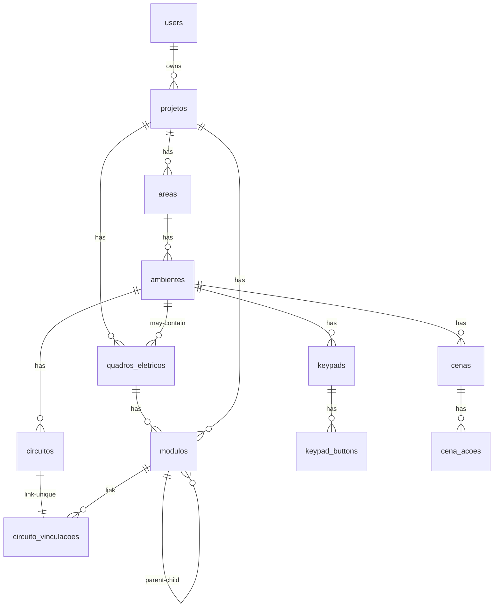

# Banco de Dados — Gerador RWP (Roehn Wizard)

> Este schema alimenta o `src.py`, que converte o **payload JSON** em um projeto `.rwp`.  
> O foco desta documentação é: **o que cada campo significa, restrições, quando é obrigatório e como o script utiliza**.

## Sumário
- [Visão Geral](#visão-geral)
- [Diagrama (alto nível)](#diagrama-alto-nível)
- [Entidades e Campos](#entidades-e-campos)
  - [users](#users)
  - [projetos](#projetos)
  - [areas](#areas)
  - [ambientes](#ambientes)
  - [quadros_eletricos](#quadros_eletricos)
  - [modulos](#modulos)
  - [circuitos](#circuitos)
  - [circuito_vinculacoes](#circuito_vinculacoes)
  - [keypads](#keypads)
  - [keypad_buttons](#keypad_buttons)
  - [cenas](#cenas)
  - [cena_acoes](#cena_acoes)
- [Relacionamentos (resumo)](#relacionamentos-resumo)
- [Regras e Validações Importantes](#regras-e-validacoes-importantes)
- [Mapeamento para o Payload JSON do `src.py`](#mapeamento-para-o-payload-json-do-srcpy)
- [Boas Práticas de Endereçamento (HSNET/DevID)](#boas-práticas-de-endereçamento-hsnetdevid)

---

## Visão Geral
- **Projeto** é a raiz.  
- Dentro dele existem **Áreas** → **Ambientes**.  
- **Quadros Elétricos** pertencem ao Projeto e (opcionalmente) a um Ambiente e contêm **Módulos**.  
- **Circuitos** pertencem a Ambientes e se vinculam a **Módulos** (canal) via **CircuitoVinculacao**.  
- **Keypads** moram nos Ambientes e possuem **Buttons** com configuração (texto, ação, ícone/rocker).  
- **Cenas** são do Ambiente e possuem **Ações** (apontam para circuito/ambiente etc. conforme `action_type`).

---

## Diagrama (alto nível)



> Observação: o diagrama é ilustrativo para entendimento de cardinalidades principais.

---

## Entidades e Campos

### users
| Campo     | Tipo        | Restrições           | Descrição | Uso no `src.py` |
|-----------|-------------|----------------------|-----------|------------------|
| `id`      | bigint PK   | auto-increment       | Identificador do usuário. | Indireto (ownership do projeto). |
| `username`| varchar(80) | `UNIQUE`, `NOT NULL` | Nome de usuário. | Não afeta o RWP diretamente. |

---

### projetos
| Campo    | Tipo       | Restrições                    | Descrição | Uso no `src.py` |
|----------|------------|--------------------------------|-----------|------------------|
| `id`     | bigint PK  | auto-increment                 | Identificador do projeto. | **Sim** (navegação da árvore). |
| `nome`   | varchar(120)| `NOT NULL`                    | Nome do projeto (aparece no RWP). | **Sim** (exibição). |
| `user_id`| bigint FK  | `NOT NULL` → `users(id)` `ON DELETE CASCADE` | Dono do projeto. | Indireto. |

**Relações**: `areas`, `quadros_eletricos`, `modulos`.

---

### areas
| Campo       | Tipo       | Restrições                        | Descrição | Uso no `src.py` |
|-------------|------------|------------------------------------|-----------|------------------|
| `id`        | bigint PK  | auto-increment                     | Identificador. | **Sim** (estrutura). |
| `nome`      | varchar(100)| `NOT NULL`                        | Nome da área. | **Sim**. |
| `projeto_id`| bigint FK  | `NOT NULL` → `projetos(id)` `ON DELETE CASCADE` | Pertence ao projeto. | **Sim** (hierarquia). |

**Relações**: `ambientes`.

---

### ambientes
| Campo     | Tipo        | Restrições                         | Descrição | Uso no `src.py` |
|-----------|-------------|-------------------------------------|-----------|------------------|
| `id`      | bigint PK   | auto-increment                      | Identificador. | **Sim** (container). |
| `nome`    | varchar(100)| `NOT NULL`                          | Nome do ambiente. | **Sim**. |
| `area_id` | bigint FK   | `NOT NULL` → `areas(id)` `ON DELETE CASCADE` | Pertence à área. | **Sim**. |

**Relações**: `circuitos`, `keypads`, `cenas`, `quadros_eletricos`.

---

### quadros_eletricos
| Campo         | Tipo       | Restrições                                             | Descrição | Uso no `src.py` |
|---------------|------------|---------------------------------------------------------|-----------|------------------|
| `id`          | bigint PK  | auto-increment                                          | Identificador. | **Sim** (organiza módulos). |
| `nome`        | varchar(100)| `NOT NULL`                                            | Nome do quadro. | **Sim**. |
| `projeto_id`  | bigint FK  | `NOT NULL` → `projetos(id)` `ON DELETE CASCADE`        | Projeto dono. | **Sim**. |
| `ambiente_id` | bigint FK  | `NULL` → `ambientes(id)` `ON DELETE SET NULL`          | Ambiente (opcional, quadro geral se `NULL`). | **Sim** (opcional). |

**Relações**: `modulos`.

---

### modulos
| Campo                 | Tipo        | Restrições                                                                 | Descrição | Uso no `src.py` |
|-----------------------|-------------|-----------------------------------------------------------------------------|-----------|------------------|
| `id`                  | bigint PK   | auto-increment                                                              | Identificador. | **Sim** (nó físico/log. ACNET). |
| `nome`                | varchar(100)| `NOT NULL`                                                                  | Rótulo do módulo. | **Sim** (exibição/lookup). |
| `tipo`                | varchar(50) | `NOT NULL`                                                                  | Ex.: `ADP-RL12`, `RL4`, `LX4`, `DIM8`, `AQL-GV-M4`, `ADP-M8`… | **Sim** (mapeia capacidades). |
| `is_controller`       | boolean     | `DEFAULT false`                                                             | Marca controladores (M4/M8/M16). | **Sim** (topologia). |
| `is_logic_server`     | boolean     | `DEFAULT false`                                                             | Indica Logic Server. | **Opcional**. |
| `ip_address`          | varchar(45) | `NULL`                                                                      | IP do controlador quando aplicável. | **Opcional**. |
| `hsnet`               | integer     | `NULL`, `UNIQUE` por `(projeto_id, hsnet)`                                  | Endereço HSNET se fixo. | **Preferível** (senão auto-atribui). |
| `dev_id`              | integer     | `NULL`                                                                      | Device ID se fixo. | **Preferível**. |
| `projeto_id`          | bigint FK   | `NOT NULL` → `projetos(id)` `ON DELETE CASCADE`                             | Projeto dono. | **Sim**. |
| `quadro_eletrico_id`  | bigint FK   | `NULL` → `quadros_eletricos(id)` `ON DELETE SET NULL`                       | Quadro hospedeiro. | **Sim** (organização). |
| `parent_controller_id`| bigint FK   | `NULL` → `modulos(id)` `ON DELETE SET NULL`                                 | Hierarquia (controlador → filho). | **Sim** (árvore ACNET). |

**Relações**: `child_modules`, `vinculacoes`.

---

### circuitos
| Campo          | Tipo             | Restrições                                                     | Descrição | Uso no `src.py` |
|----------------|------------------|-----------------------------------------------------------------|-----------|------------------|
| `id`           | bigint PK        | auto-increment                                                  | Identificador. | **Sim**. |
| `identificador`| varchar(20)      | `NOT NULL`                                                      | Tag curto (ex.: “L1”). | **Sim** (nomes/labels). |
| `nome`         | varchar(100)     | `NOT NULL`                                                      | Nome do circuito. | **Sim**. |
| `tipo`         | varchar(20)      | `NOT NULL`, `CHECK in ('luz','persiana','hvac')`                | Tipo funcional. | **Sim** (gera entidade correta). |
| `dimerizavel`  | boolean          | `DEFAULT false`                                                 | Apenas para `luz`. | **Sim** (config DIM). |
| `potencia`     | double precision | `DEFAULT 0.0`                                                   | Potência estimada/nominal. | **Sim** (metadado). |
| `ambiente_id`  | bigint FK        | `NOT NULL` → `ambientes(id)` `ON DELETE CASCADE`               | Dono. | **Sim**. |

**Relações**: `vinculacao` (1–1).

---

### circuito_vinculacoes
| Campo        | Tipo      | Restrições                                                        | Descrição | Uso no `src.py` |
|--------------|-----------|--------------------------------------------------------------------|-----------|------------------|
| `id`         | bigint PK | auto-increment                                                     | Identificador. | **Sim**. |
| `canal`      | integer   | `NOT NULL`, `CHECK canal >= 0`                                     | Canal do módulo. | **Sim** (end-point físico). |
| `circuito_id`| bigint FK | `NOT NULL`, **`UNIQUE`**, → `circuitos(id)` `ON DELETE CASCADE`    | Um circuito só pode ter 1 vinculação. | **Essencial**. |
| `modulo_id`  | bigint FK | `NOT NULL` → `modulos(id)` `ON DELETE CASCADE`                    | Módulo alvo. | **Essencial**. |

---

### keypads
| Campo         | Tipo        | Restrições                                             | Descrição | Uso no `src.py` |
|---------------|-------------|---------------------------------------------------------|-----------|------------------|
| `id`          | bigint PK   | auto-increment                                          | Identificador. | **Sim**. |
| `nome`        | varchar(100)| `NOT NULL`                                              | Nome do keypad. | **Sim**. |
| `modelo`      | varchar(50) | `NULL`                                                  | Modelo (opcional). | **Opcional**. |
| `color`       | varchar(20) | `NULL`                                                  | Cor base. | **Opcional**. |
| `button_color`| varchar(20) | `NULL`                                                  | Cor dos botões. | **Opcional**. |
| `button_count`| integer     | `NOT NULL`, `> 0`                                       | Nº de botões. | **Sim**. |
| `hsnet`       | integer     | `NOT NULL`, `UNIQUE`                                    | Endereço HSNET único. | **Recomendado** (fixo). |
| `dev_id`      | integer     | `NOT NULL`, `UNIQUE`                                    | Device ID único. | **Recomendado** (fixo). |
| `ambiente_id` | bigint FK   | `NOT NULL` → `ambientes(id)` `ON DELETE CASCADE`        | Dono. | **Sim**. |

**Relações**: `buttons`.

---

### keypad_buttons
| Campo         | Tipo         | Restrições                            | Descrição | Uso no `src.py` |
|---------------|--------------|----------------------------------------|-----------|------------------|
| `id`          | bigint PK    | auto-increment                         | Identificador. | **Sim**. |
| `button_index`| integer      | `NOT NULL`, `> 0`                      | Posição física (1..N). | **Sim** (ordem). |
| `icon`        | varchar(50)  | `NULL`                                 | Ícone opcional. | **Opcional**. |
| `is_rocker`   | boolean      | `DEFAULT false`                        | Se é “rocker”. | **Sim** (estilo). |
| `rocker_style`| varchar(20)  | `NULL`                                 | `up-down`, `left-right`, etc. | **Opcional**. |
| `json_config` | jsonb        | `NULL`                                 | `{"EngraverText": "...", "action": {"type": X, "target_type": "...", "target_id": N}}` | **Essencial** (texto/ação). |
| `keypad_id`   | bigint FK    | `NOT NULL` → `keypads(id)` `ON DELETE CASCADE` | Dono. | **Sim**. |

---

### cenas
| Campo         | Tipo         | Restrições                                             | Descrição | Uso no `src.py` |
|---------------|--------------|---------------------------------------------------------|-----------|------------------|
| `id`          | bigint PK    | auto-increment                                          | Identificador. | **Sim**. |
| `guid`        | varchar(36)  | `NOT NULL`, `UNIQUE`                                    | GUID usado como alvo. | **Essencial**. |
| `nome`        | varchar(100) | `NOT NULL`                                              | Nome da cena. | **Sim**. |
| `scene_movers`| boolean      | `DEFAULT false`                                         | Flag de movers. | **Opcional**. |
| `ambiente_id` | bigint FK    | `NOT NULL` → `ambientes(id)` `ON DELETE CASCADE`        | Dono. | **Sim**. |

**Relações**: `acoes`.

---

### cena_acoes
| Campo        | Tipo     | Restrições                                      | Descrição | Uso no `src.py` |
|--------------|----------|--------------------------------------------------|-----------|------------------|
| `id`         | bigint PK| auto-increment                                   | Identificador. | **Sim**. |
| `action_type`| integer  | `NOT NULL`                                       | Semântica do alvo: `0=circuito`, `7=ambiente`, etc. | **Essencial** (interpretação). |
| `level`      | integer  | `DEFAULT 100`                                    | Nível (ex.: dim). | **Sim** (parâmetro). |
| `target_id`  | integer  | `NOT NULL`                                       | ID do alvo conforme `action_type`. | **Essencial**. |
| `cena_id`    | bigint FK| `NOT NULL` → `cenas(id)` `ON DELETE CASCADE`     | Dono. | **Sim**. |

---

## Relacionamentos (resumo)

| Relação | Cardinalidade | Chaves |
|--------|----------------|--------|
| `users` → `projetos` | 1:N | `projetos.user_id` |
| `projetos` → `areas` | 1:N | `areas.projeto_id` |
| `areas` → `ambientes` | 1:N | `ambientes.area_id` |
| `projetos` → `quadros_eletricos` | 1:N | `quadros_eletricos.projeto_id` |
| `ambientes` → `quadros_eletricos` | 1:N (opcional) | `quadros_eletricos.ambiente_id` |
| `quadros_eletricos` → `modulos` | 1:N | `modulos.quadro_eletrico_id` |
| `projetos` → `modulos` | 1:N | `modulos.projeto_id` |
| `modulos` → `modulos` (parent) | 1:N | `modulos.parent_controller_id` |
| `ambientes` → `circuitos` | 1:N | `circuitos.ambiente_id` |
| `circuitos` ↔ `circuito_vinculacoes` | 1:1 | `circuito_vinculacoes.circuito_id` (UNIQUE) |
| `modulos` → `circuito_vinculacoes` | 1:N | `circuito_vinculacoes.modulo_id` |
| `ambientes` → `keypads` | 1:N | `keypads.ambiente_id` |
| `keypads` → `keypad_buttons` | 1:N | `keypad_buttons.keypad_id` |
| `ambientes` → `cenas` | 1:N | `cenas.ambiente_id` |
| `cenas` → `cena_acoes` | 1:N | `cena_acoes.cena_id` |

---

## Regras e Validações Importantes

| Regra | Motivo | Onde/Como |
|------|--------|-----------|
| `circuito_vinculacoes.circuito_id` é `UNIQUE` | Impede múltiplas vinculações para o mesmo circuito | Constraint UNIQUE |
| `keypads.hsnet` e `keypads.dev_id` são `UNIQUE` | Endereços físicos lógicos únicos por keypad | Constraints UNIQUE |
| `(modulos.projeto_id, modulos.hsnet)` `UNIQUE` | Evita colisão de HSNET no mesmo projeto | Constraint UNIQUE |
| `circuitos.tipo` limitado a `('luz','persiana','hvac')` | Alinha com entidades esperadas no RWP | CHECK constraint |
| `button_count > 0`, `button_index > 0`, `canal >= 0` | Sanitização de faixas válidas | CHECK constraints |
| `ON DELETE CASCADE` nas FKs estruturais | Evita órfãos quando remover projeto/área/ambiente | Definição de FK |
| `ON DELETE SET NULL` onde apropriado | Manter histórico sem apagar módulos/quadro automaticamente | Definição de FK |

---

## Mapeamento para o Payload JSON do `src.py`

Exemplo **ilustrativo** de agregação dos dados para o gerador:

```json
{
  "projeto": {
    "id": 1,
    "nome": "Residência Exemplo",
    "areas": [
      {
        "id": 10,
        "nome": "Social",
        "ambientes": [
          {
            "id": 100,
            "nome": "Sala de Estar",
            "quadros_eletricos": [
              {
                "id": 1000,
                "nome": "QDG-Sala",
                "modulos": [
                  {
                    "id": 2000,
                    "nome": "ADP-RL12 Sala",
                    "tipo": "ADP-RL12",
                    "is_controller": false,
                    "hsnet": 12,
                    "dev_id": 512
                  }
                ]
              }
            ],
            "circuitos": [
              {
                "id": 3000,
                "identificador": "L1",
                "nome": "Luz Principal",
                "tipo": "luz",
                "dimerizavel": true,
                "potencia": 120.0,
                "vinculacao": {
                  "canal": 1,
                  "modulo": { "id": 2000, "nome": "ADP-RL12 Sala" }
                }
              }
            ],
            "keypads": [
              {
                "id": 4000,
                "nome": "Teclado Sala 4B",
                "modelo": "Rocker 4",
                "color": "white",
                "button_color": "gray",
                "button_count": 4,
                "hsnet": 21,
                "dev_id": 600,
                "buttons": [
                  {
                    "button_index": 1,
                    "icon": "bulb",
                    "is_rocker": false,
                    "json_config": {
                      "EngraverText": "Luz",
                      "action": { "type": 0, "target_type": "circuito", "target_id": 3000 }
                    }
                  }
                ]
              }
            ],
            "cenas": [
              {
                "id": 5000,
                "guid": "0b3a5d3e-6d6a-4a81-9f4c-1c2b7f1f0002",
                "nome": "CENA FILME",
                "scene_movers": false,
                "acoes": [
                  { "action_type": 0, "level": 30, "target_id": 3000 }
                ]
              }
            ]
          }
        ]
      }
    ]
  }
}
```

**Notas de uso no script:**
- O script usa `areas[]/ambientes[]/...` para percorrer a estrutura.  
- `modulos[].tipo` define como o módulo será interpretado (saídas, dimmers, controladores etc.).  
- `circuitos[].vinculacao` é **obrigatória** para que a carga seja fisicamente mapeada no RWP.  
- `keypad_buttons[].json_config.EngraverText` define a gravação (texto) e `action` define o alvo.  
- `cenas[].guid` é usado como identificador estável de cena (útil para botões/ações).

---

## Boas Práticas de Endereçamento (HSNET/DevID)

| Item | Recomendações |
|------|---------------|
| **HSNET/DevID de Módulos** | Se você fornecer `hsnet`/`dev_id` previamente, garante consistência entre builds. Se omitir, o script pode auto-atribuir; evite colisões. |
| **HSNET/DevID de Keypads** | **Obrigatórios** e **únicos**: isto evita problemas de descoberta/pareamento no barramento e facilita depuração. |
| **Único por Projeto** | Para módulos, use a `UNIQUE(projeto_id, hsnet)`; para keypads, `UNIQUE(hsnet)` e `UNIQUE(dev_id)` globais funcionam bem. |
| **Planejamento** | Reserve ranges (ex.: 1–20 controladores, 21–100 periféricos) para manter organização entre sites/andares. |
